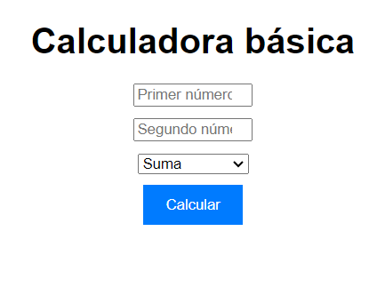

# Calculadora Básica
- Versión: 0.1
- Autor: **Carmen**
- Licencia: ninguna

## Descripción del Proyecto
Este proyecto consiste en una calculadora básica desarrollada utilizando HTML, CSS y JavaScript. La calculadora permite realizar operaciones matemáticas simples, como suma, resta, multiplicación y división.

## Objetivos
El objetivo principal de este proyecto es proporcionar una herramienta simple y fácil de usar para realizar cálculos matemáticos básicos en un entorno web.

## Tecnologías Utilizadas
- HTML
- CSS
- JavaScript

## Arquitectura del Proyecto
El proyecto sigue una arquitectura básica de cliente-servidor, donde el cliente (navegador web) interactúa con la interfaz de usuario desarrollada en HTML y CSS, mientras que el código JavaScript maneja la lógica de cálculo de la calculadora.

## Funcionalidades
- Suma de dos números
- Resta de dos números
- Multiplicación de dos números
- División de dos números
- Manejo de errores como divisiones por cero y entradas inválidas

## Instrucciones de Instalación y Uso
1. Clona este repositorio en tu máquina local.
2. Abre el archivo `index.html` en tu navegador web.
3. Ingresa los números en los campos correspondientes.
4. Selecciona la operación deseada en el menú desplegable.
5. Haz clic en el botón "Calcular" para obtener el resultado.
6. El resultado se mostrará debajo del botón de cálculo.

## Solución de Problemas Comunes
- **Entradas inválidas:** La calculadora maneja entradas inválidas mostrando un mensaje de error cuando los campos no contienen números válidos.
- **División por cero:** Se muestra un mensaje de error cuando se intenta dividir por cero.

